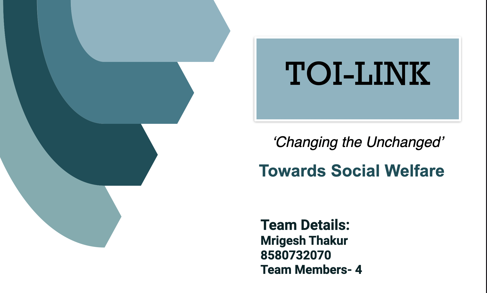
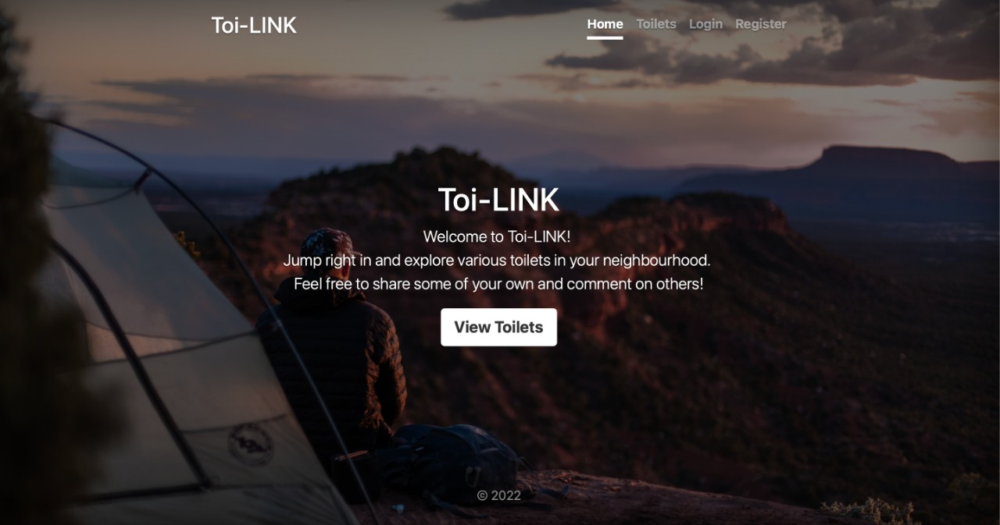
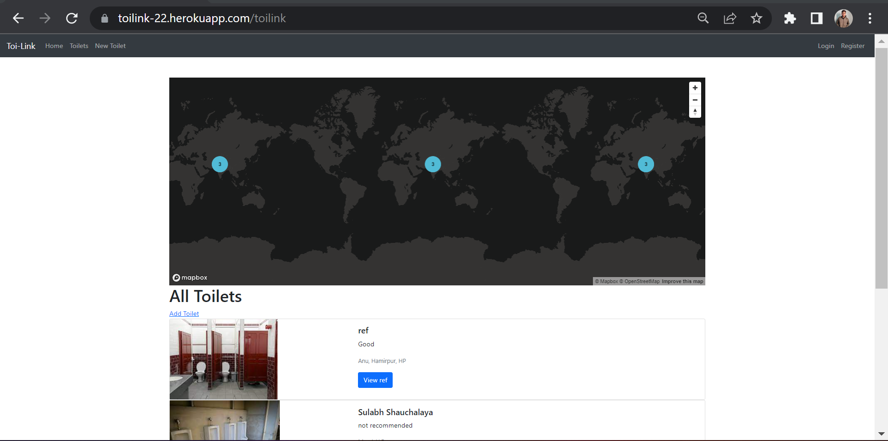
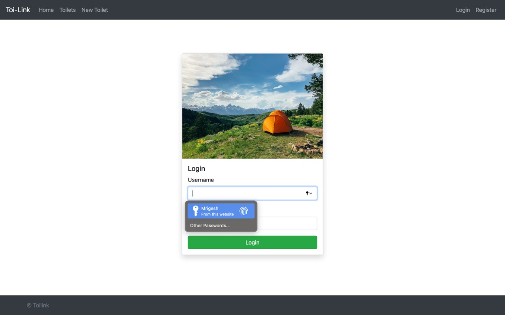
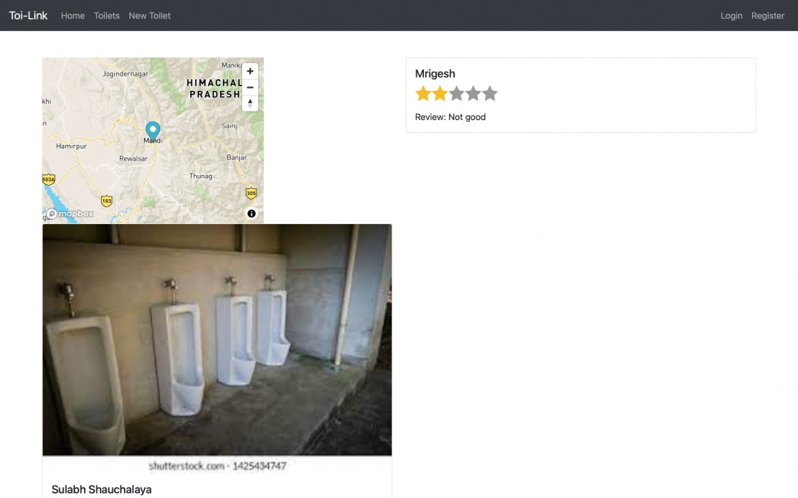
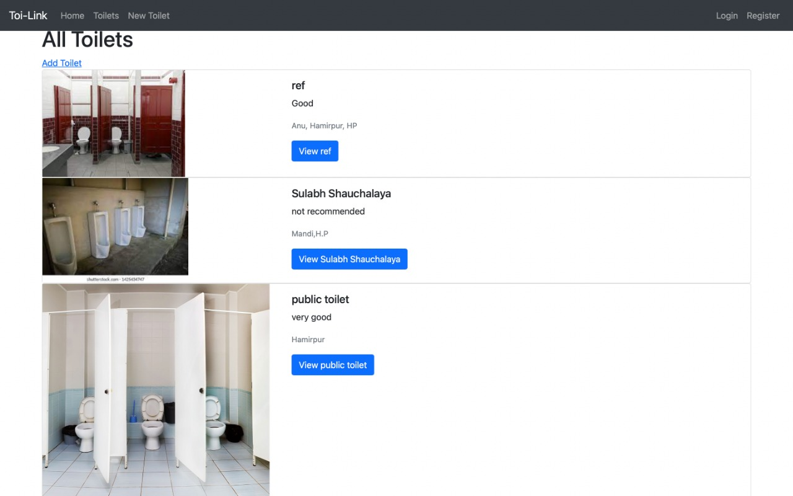

# TOI-LINK 

#Deployed at 

https://toilink-22.herokuapp.com

#A brief about our project

https://drive.google.com/file/d/1pkb8iFFe5LlVQWJk6t4b0Npoxan05DcE/view?usp=sharing

 

🛠 &nbsp;Tech Stack

 

 Html,CSS,Javascript,Node.js, Mongo Atlas, Map-box api and EXPRESS framework
 

##  💼 &nbsp; Challenges we ran into

Integrating Map-Box api to our site and putting backend for the user review section.

## 🔭 &nbsp; About this Project

>Have you ever glanced at a public toilet but refrained from
using it after noticing how unclean it is?
Our project targets to change this perception about public
toilets and create new norm about them!
We have designed a website through which a user can spread
awareness about where a public toilet is lacking.
Our project will help the required authorities to maintain and
repair the required public toilets based on the information
gathered by our website, which has been taken from the users
themselves.
Our site also can be used as a gateway to locate public toilets
near you and further provide feedback for the need of creation
of new public toilets.

----

*Description of the Project*

``Our Project is a Website with individual review interface  backed with the power of Node framework.``

           
Website

           

         

         

>Public toilets cause more problems than providing
solution to the public users, due to their lack of
maintenance and cleanliness.Our project aims to
provide solution to this problem through social
feedback and social awareness.

>1) Home:Main page is designed keeping it's aesthetic aspect high so that perception of public toilets being attached with negative emotion change. It has a UI designed to give user a sense of comfort and vividness.

we have created login/register interface page backed with the power of express framework .

>>We made the login page user friendly so that it remember you, so that you don't have to sign in again and again. 

>>>We also integrated map box api, which creates cluster maps to help the user know about all the toilets nearby him/her. (You can then check toilets near me pagefor info). You can access map also from this page(top right corner), you can also put your entire journey for better info.You can also put your reviews and wether you were satisfied or not. Links to home page and your profile are also given.

>>>Our site also have map feature to give you overview about public restrooms around you and your route of journey.

----
>2) About Toilets:
Moving in homepage further will give a brief description about all the toilets listed and provide a overview about them . Our main objective is to bring out best confident personality from within you , and lend a helping hand ,which has been explained in this section of webpage. 

----

>3) Show Page: It has reviews, location, price and images of a particular restroom. 

<!-- LICENSE -->
##   

Distributed under the MIT License. See `LICENSE` for more information.
